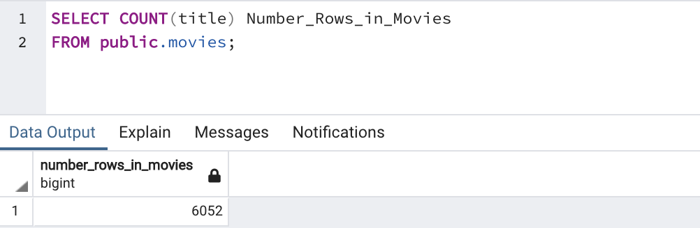
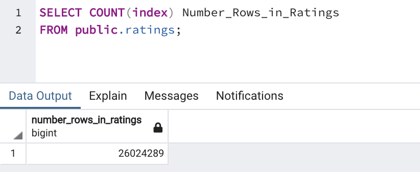

# ETL-analysis

## Overview of Project and Purpose
Utilizing python code in Jupyter Notebook to extract, transform, and load movies data into a Postgresql Database. This entire process shows how easy and seemless it can be to not only pull data from multiple sources into dataframes, using Python. But to then transform and clean the data, such that it can easily be imported into a database. 

## Analysis 
After cleaning the movies dataset, and importing into Postgresql, there was a total of 6,052 rows. 
 

After cleaning the ratings dataset, and importing into Postgresql, there was a total of 26,024,289 rows.
 
